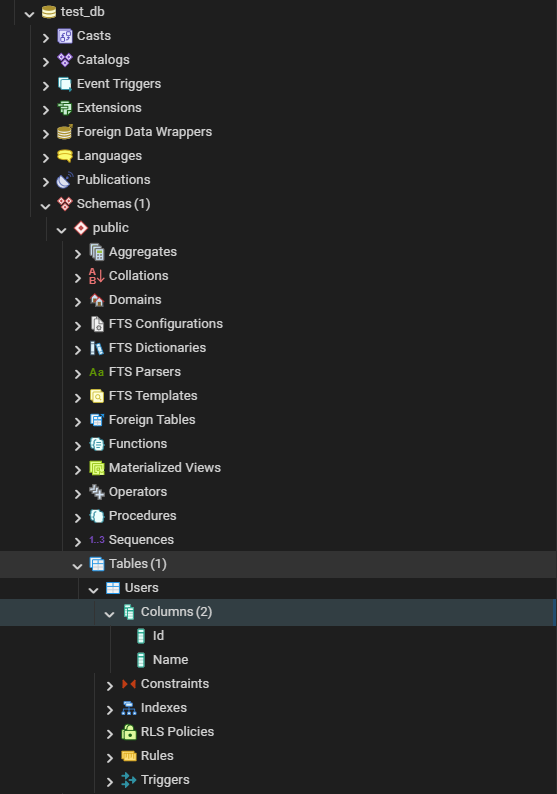

**Выполнение домашнего задания по установке postgres.**

1. Установил и запустил Docker Desktop;
2. Запустил CMD и выполнил команду: docker run --name postgres-container-17 -p 5432:5432 -e POSTGRES_USER=postgres -e POSTGRES_PASSWORD=postgres -e POSTGRES_DB=test_db -e PGDATA=/var/lib/postgresql/data/pgdata -d postgres:17

 -- Имя контейнера: postgres-container-17;
 -- Порт для внешних подключений 5432;
 -- Пользователь: postgres;
 -- Пароль: postgres;
 -- БД по умолчанию:test_db;
 -- PGDATA - задан путь, по которому храним данные БД;
 -- -d - запуск контейнера в фоновом режиме;
 -- версия postgres (17);

Контейнер:
 

Подключение pgAdmin, чистая база test_db:
 

3. Создал таблицу Users, добавил данные;
 
 Выполнил команду добавления данных
  `INSERT INTO public."Users"(
	"Id", "Name")
	VALUES (gen_random_uuid(), 'mike');`

4. Удалил контейнер;
5. Запустил контейнер заново;
6. Данные **не сохранились**;
 

Если повторить действия, но в запуске контейнера прописать путь для хранения данных бд на машине(volume), где запускается контейнер, то после пересоздания контейнера данные **сохранятся**.
Например, добавляем -v /postgres-test:/var/lib/postgresql/data.
 
Тогда данные сохранятся в \\wsl.localhost\docker-desktop\tmp\docker-desktop-root\postgres-test\pgdata