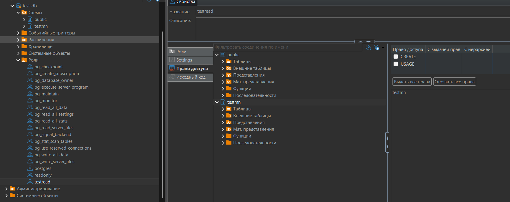
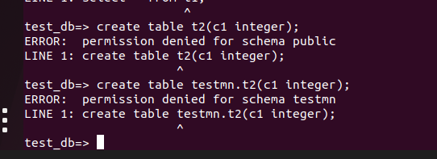

**Выполнение домашнего задания: "Работа с базами данных, пользователями и правами"**

1. Создал кластер PostgresSQL 17;

2. Зашёл под postgres `sudo -u postgres psql postgres`;
3. Создал тестовую бд test_db `create database test_db;`;

4. Выполнил коннект к новой базе данных `\connect test_db;`;

Создал новую схему в базе данных test_db с помощью команды `create schema if not exists testmn;`;

5. Создал таблицу t1 командой `create table if not exists testmn.t1(c1 integer not null);`;

6. Добавил в таблицу t1 запись командой `insert into testmn.t1(1)`;

7. Создал роль readonly командой `create role readonly;`;

8. Выдал права на подключение к test_db роли readonly командой `grant connect on database test_db to readonly;`;
9. Выдал права readonly на использование схемы testmn командой `grant usage on schema testmn to readonly;`.

10. Выдал права readonly на select всех таблиц в схеме testmn командой `grant select on all tables in schema testmn to readonly;`

11. Создал пользователя testread командой `create user testread with password 'test123';`

12. Дал роль readonly пользователю testread команлой `grant readonly to testread`;

13. Выполнил подключение новым пользователем через команду `\c test_db testread;`

14. Выполнил `select * from testmn.t1;`. Получил результат:

Всё получилось, потому что делал сам и задал схему при создании таблицы t1. Сейчас посмотрел предыдущие шаги в шпаргалке и там при создании таблицы нет явного указания схемы, следовательно таблица создастся в public.
15. Попробовал создать таблицу t2 сначала выполнив скрипт из ДЗ `create table t2(c1 integer);`. Затем попробовал создать t2 в схеме testmn: `create table testmn.t2(c1 integer);`. В обоих случаях получил ошибку, нет прав на создание:
, что логично, потому что прав у роли на создание таблиц нет.

16. Чтобы создалась таблица t2 или t3 нужно выдать права на создание либо роли либо пользователю. Зашёл под пользователем postgres и выдал права на создание: `grant create on schema testmn to testread;`. После перезашёл под testread и создал таблицы t2, t3:

Выполнял на postgres 17, поэтому по умолчанию нет прав на создание в public;