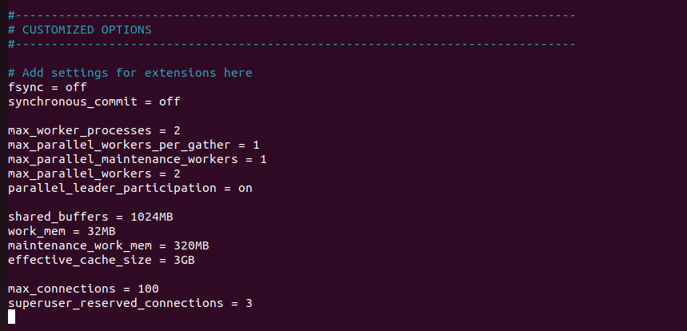
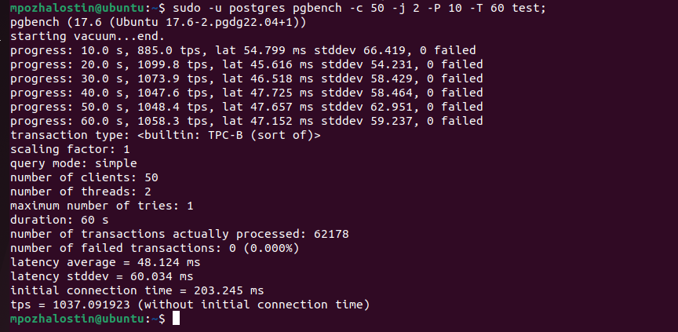

**Выполнение домашнего задания: "Работа с базами данных, пользователями и правами"**

1. Параметры виртуальной машины, на которой развёрнут Postgres 17:
ОЗУ: 4096 МБ;
CPU: 2 процессора;
Жёсткий диск: Два HDD диска на 25 и 10 гб;

2. Создал тестовую базу данных test под пользователем postgres;
3. Выполнил инициализацию pgbench командой `sudo -u postgres pgbench -i test;`

4. Выполнил нагрузочное тестирование до изменения конфигов Postgres командой `sudo -u postgres pgbench -c 50 -j 2 -P 10 -T 60 test;`
Результат: 487 tps

5. Изменил параметры конфигов:

6. После применения параметров результат: 1037 tps;

Более быстрой работы добиться не смог. Т.к. ресурсы машины не очень велики, то больше всего эффект заметен при изменении
параметров работы с диском fsync и synchronous_commit;