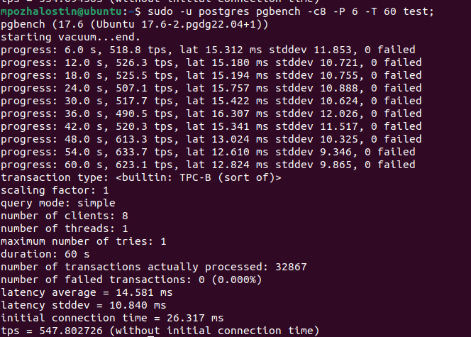
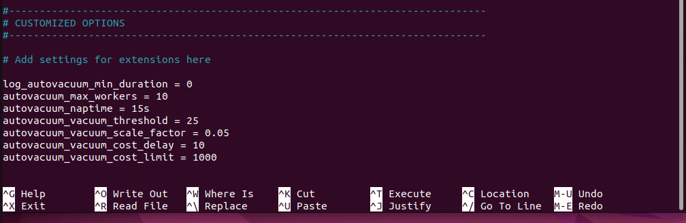
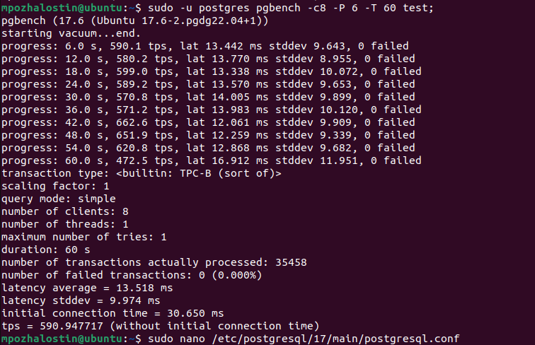
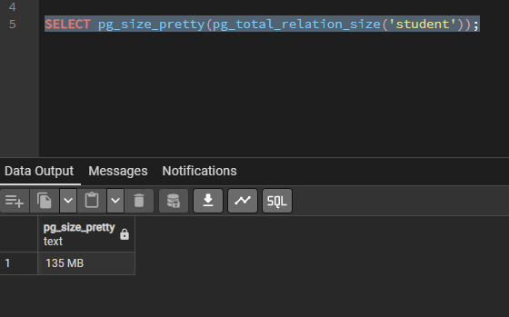
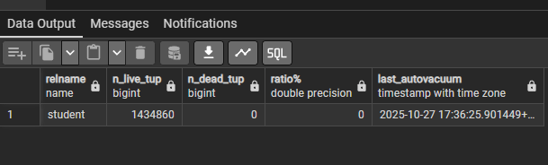
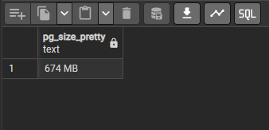
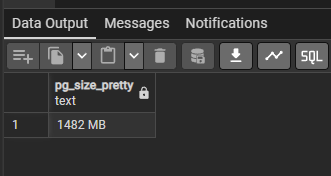

**Выполнение домашнего задания: "Работа с базами данных, пользователями и правами"**

1. Сделан инстанс VM и установнен postgres 17;
2. Создал тестовую базу данных test под пользователем postgres;
3. Выполнил инициализацию pgbench командой `sudo -u postgres pgbench -i test;`

4. Выполнил нагрузочное тестирование до изменения конфигов Postgres командой `sudo -u postgres pgbench -c8 -P 6 -T 60 test;`
Результат: 547 tps

5. Изменил параметры конфигов:

6. После применения параметров результат: 590 tps;

Нет большого эффекта от применения более агрессивных настроек, потому что не было работы с большими объёмами данных.

7. Создал таблицу student `CREATE TABLE student( id serial, fio char(100) );` заполнил значениями `INSERT INTO student(fio) SELECT 'noname' FROM generate_series(1,1000000);`

8. Размер 135МБ 

9. 5 раз обновил таблицу значениями noname5! `UPDATE student SET fio = 'noname12345';`

10. Выполнил проверку кол-ва строк `SELECT relname, n_live_tup, n_dead_tup, trunc(100*n_dead_tup/(n_live_tup+1))::float AS "ratio%", last_autovacuum FROM pg_stat_user_tables WHERE relname = 'student';`

11. Ещё раз обновил 5 раз данные добавляя символ. 

12. Убрал автовакуум из таблицы student `ALTER TABLE student SET (autovacuum_enabled = off);`;

13. 10 раз обновил данные. Результат - данные занимают больше места (больше чем в 2 раза), т.к. автовакуум отключен.
