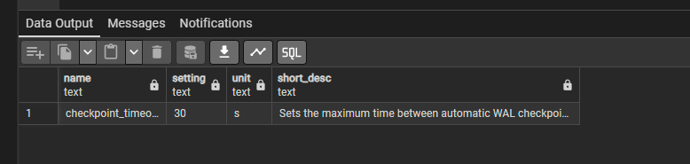
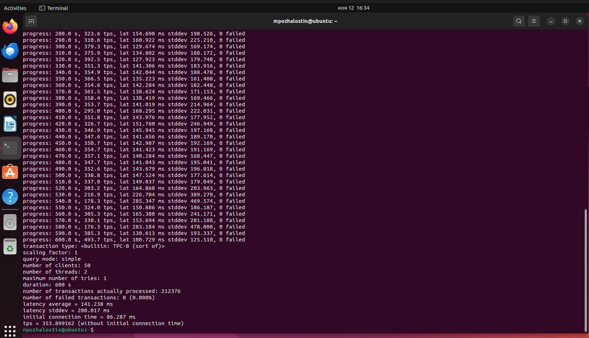
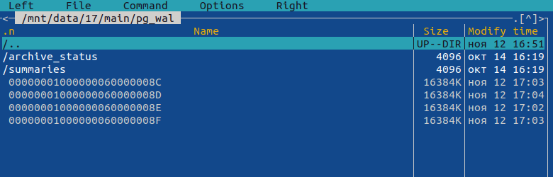
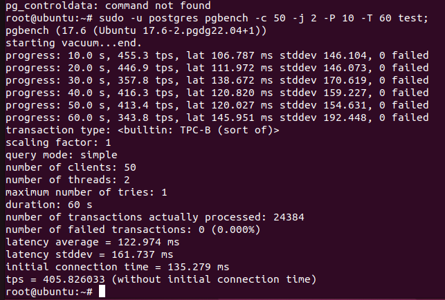
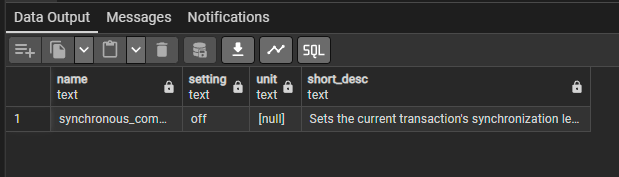
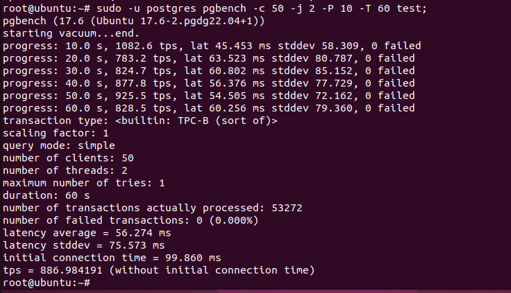

**Выполнение домашнего задания: "Работа с журналами и контрольными точками"**

1. Выставил настройку checkpoint_timeout командой `ALTER SYSTEM SET checkpoint_timeout = '30s'; SELECT pg_reload_conf();`. Значение 30 сек.;

2. Запустил нагрузку на бд на 10 мин командой `sudo -u postgres pgbench -c 50 -j 2 -P 10 -T 600 test;`;

3. Просмотрел объём файлов журнала. Было сгенерировано 4 файла по 16 мб.
На одну контрольную точку примерно приходится 3,2 мб записей журналов.
 
4. Выполнил при синхронных коммитах нагрузку `sudo -u postgres pgbench -c 50 -j 2 -P 10 -T 60 test;`
Результат: 405 tps;
 
5. Включил асинхронный коммит `ALTER SYSTEM SET synchronous_commit = off; SELECT pg_reload_conf();`:
 
6. Выполнил при асинхронных коммитах нагрузку `sudo -u postgres pgbench -c 50 -j 2 -P 10 -T 60 test;`
Результат: 886 tps;
 
7. Проинициализировал новый кластер и включил проверку контрольных сумм `sudo -u postgres /usr/lib/postgresql/17/bin/initdb -D /var/lib/postgresql/data-checksum --data-checksums`;
8. Создал таблицу testdb и остановил кластер `sudo -u postgres /usr/lib/postgresql/17/bin/pg_ctl -D /var/lib/postgresql/data-checksum stop`;
9. Изменил байты в таблице testdb `sudo dd if=/dev/zero of=/var/lib/postgresql/data-checksum/base/16384/16385 bs=1 count=2 seek=100 conv=notrunc`;
10. Запустил кластер и попробовал прочитать данные из testdb;
Получил ошибку: `ERROR: invalid page in block 0 of relation base/16384/16385 HINT: Please run the 'pg_checksums' command to verify checksums.`;
11. Для игнорирования ошибки нужно выставить параметр zero_damaged_pages = on;