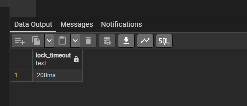
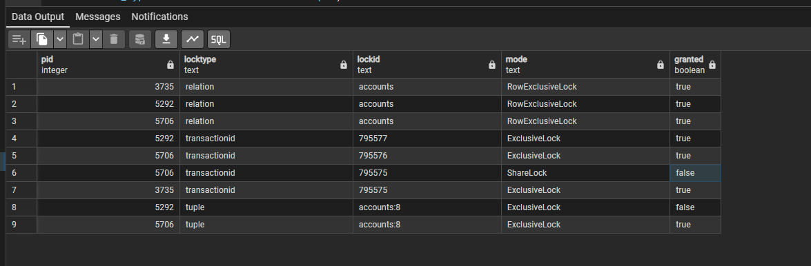
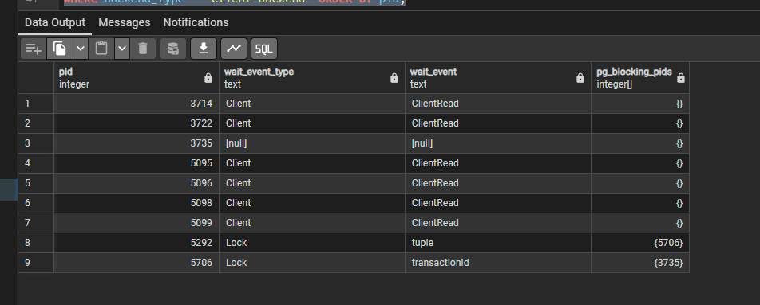
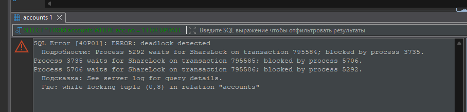
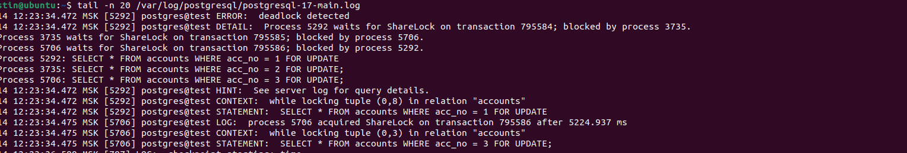

**Выполнение домашнего задания: "Блокировки"**

1. Выставил настройку lock_timeout командой `ALTER SYSTEM SET lock_timeout = "200ms"; SELECT pg_reload_conf();`. Значение 200ms;

2. При обновлении строки из разных сессий получил ошибку в логе;

3. Выполнил обновление одной и той же строки в таблице accounts. Сделал представление locks_v в котором выводится строки:

Две транзакции заблокированы. Более подробную информацию смотрим в pg_stat_activity

Отсюда уже видно что tuple ссылается на уже ожидающую транзацию 5706. Получается своеобразная очередь транзакций.
4. Воспроизвёл ситуацию дедлока по трём транзакциям.
1 транзакция: `BEGIN; SELECT * FROM accounts WHERE acc_no = 1 FOR UPDATE;`
2 транзакция: `BEGIN; SELECT * FROM accounts WHERE acc_no = 2 FOR UPDATE;`
3 транзакция: `BEGIN; SELECT * FROM accounts WHERE acc_no = 3 FOR UPDATE;`
1 транзакция: `BEGIN; SELECT * FROM accounts WHERE acc_no = 2 FOR UPDATE;`
2 транзакция: `BEGIN; SELECT * FROM accounts WHERE acc_no = 3 FOR UPDATE;`
3 транзакция: `BEGIN; SELECT * FROM accounts WHERE acc_no = 1 FOR UPDATE;`

По логам можно отледить deadlock

5. Две транзакции, выполняющие единственный UPDATE таблицы без WHERE, не способны создать взаимоблокировку. Одна из них обязательно будет ждать другую — то есть будет блокировка в одну сторону, но не цикл, а значит deadlock невозможен.