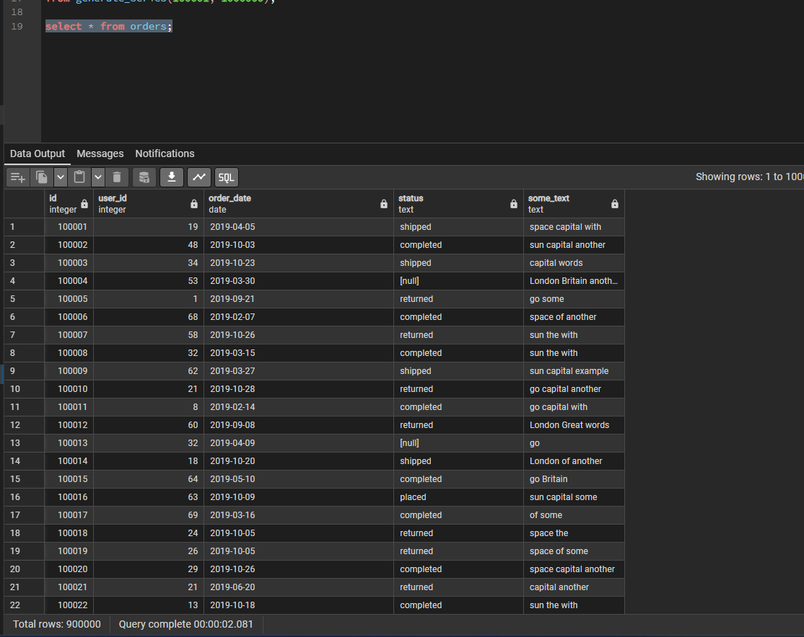
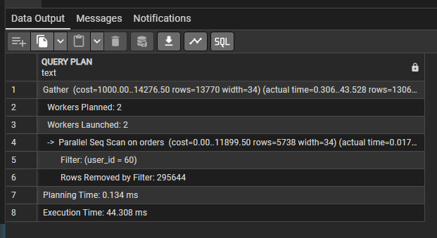
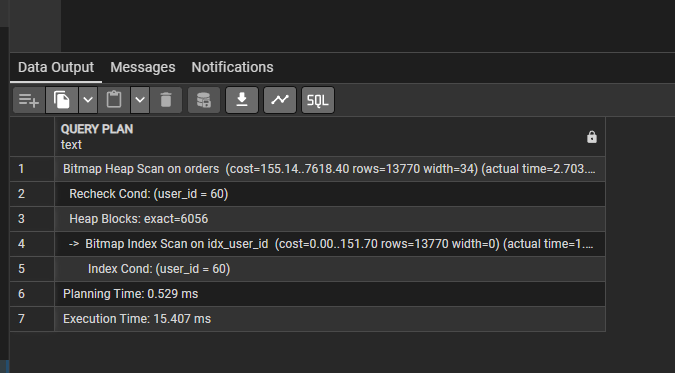
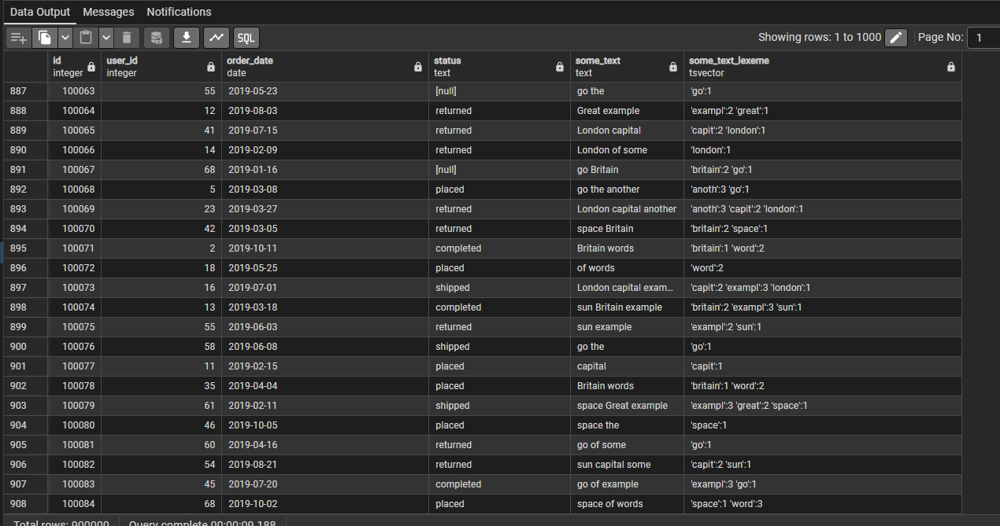
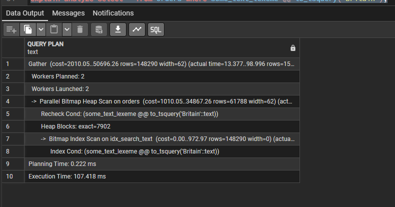
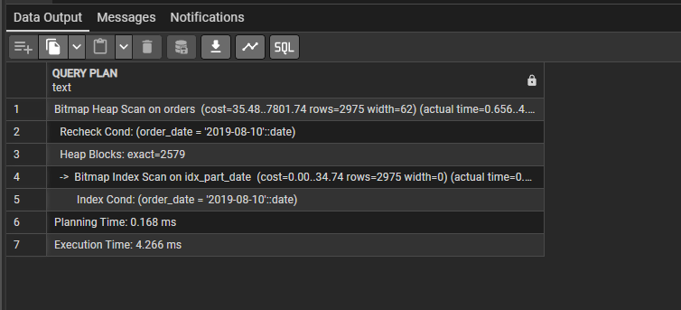
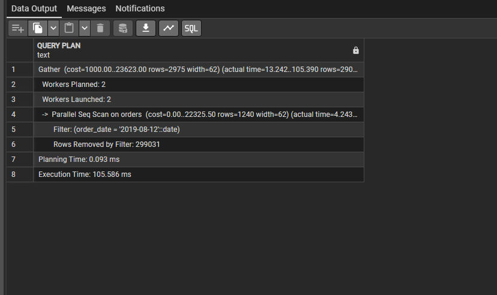
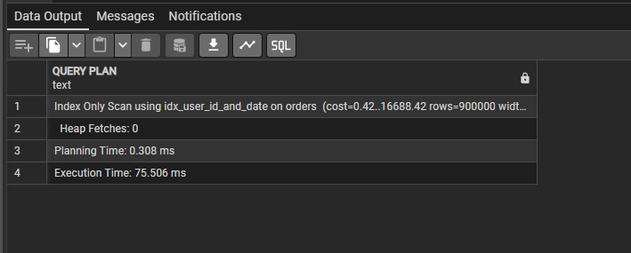

**Выполнение домашнего задания: "Работа с индексами"**

1. Создал таблицу orders и заполнил данными;

2. Создал план запроса выборки по user_id без создания индекса `explain analyze select * from orders where user_id = 60;` Результат выполнения: 44ms;

3. Создал индекс на user_id `create index idx_user_id on orders (user_id);`. Повторил запрос из п.2. Результат выполнения: 15ms;

4. Для создания индекса для полнотекстового поиска необходим столбец с типом tsvector. Создал столбец some_text_lexeme и перенёс данные из some_text командами `alter table orders add column some_text_lexeme tsvector; update orders set some_text_lexeme = to_tsvector(some_text);`

5. Создал GIN индекс для полнотекстового поиска по тексту `create index idx_search_text on orders using gin (some_text_lexeme);`
6. Выполнил `explain analyze select * from orders where some_text_lexeme @@ to_tsquery('Britain');`;

7. Создал индекс на часть таблицы `create index idx_part_date on orders (order_date) where order_date < '2019-08-11';`;
Создал план для выборок по двум датам `explain analyze select * from orders where order_date = '2019-08-10';` и `explain analyze select * from orders where order_date = '2019-08-12';`
По первой индекс сработал:

По второй индекс не сработал:

8. Создал составной индекс `create index idx_user_id_and_date on orders (user_id, order_date);` и выполнил выборку по двум столбцам `explain analyze select user_id, order_date from orders;`

В файле Indexes.sql приложил все команды, которые выполнял.