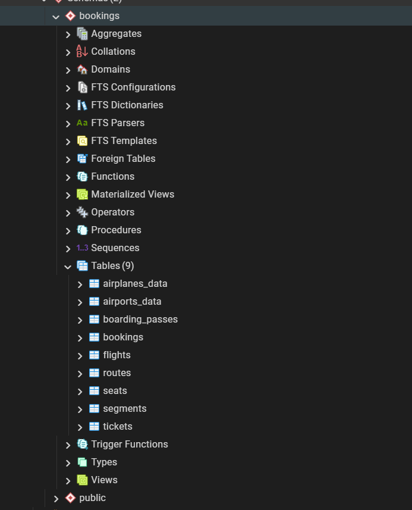
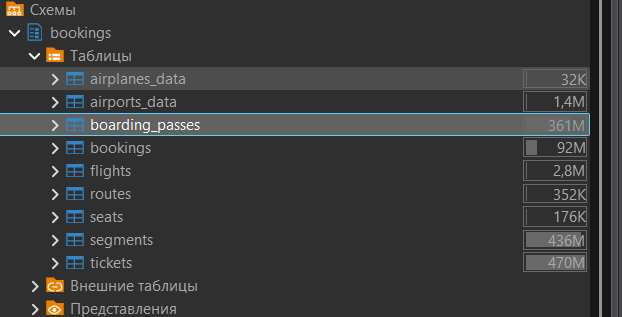
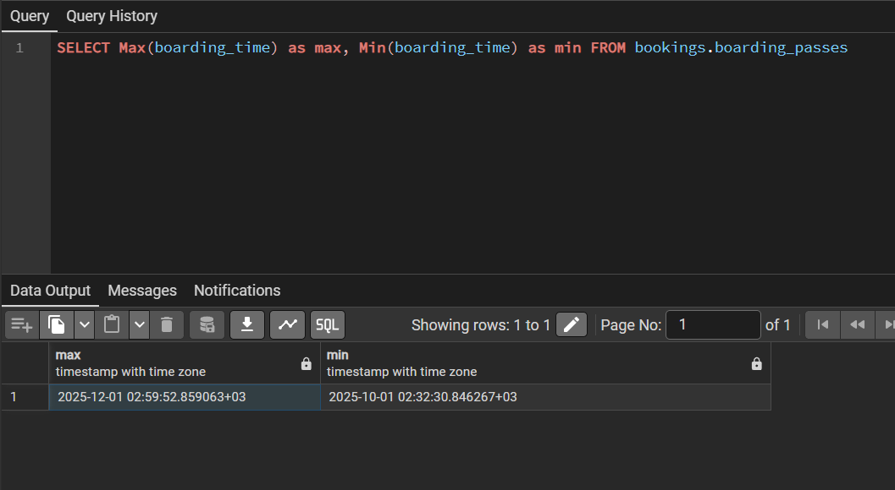
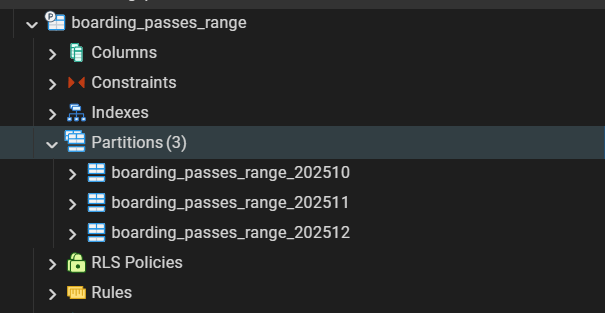
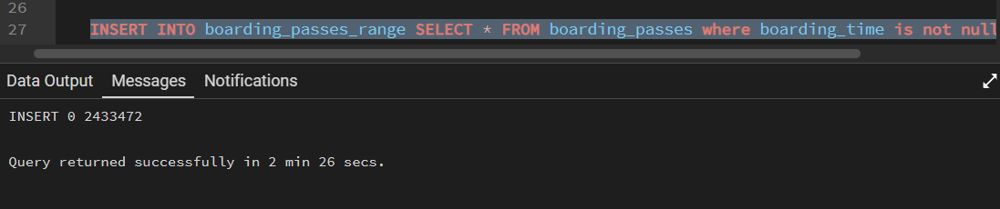
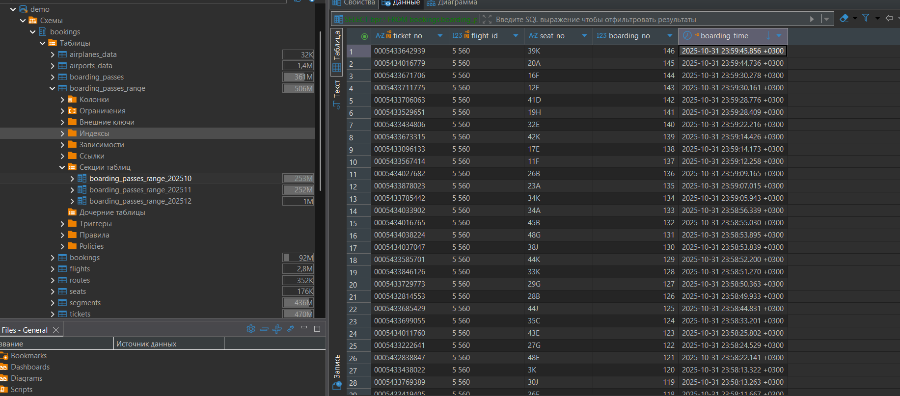
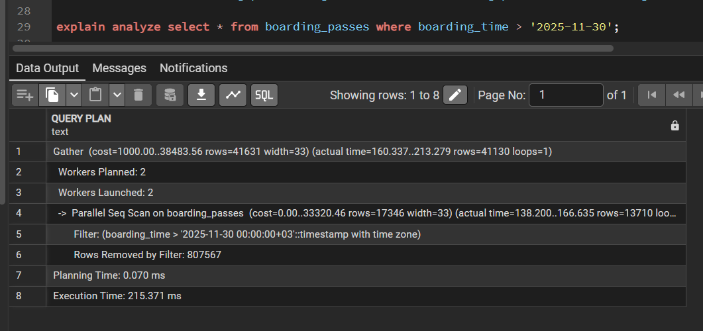
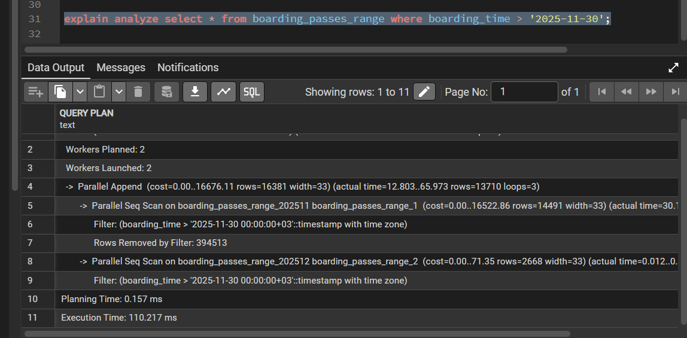
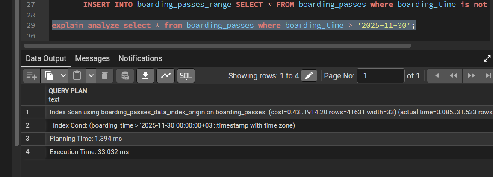
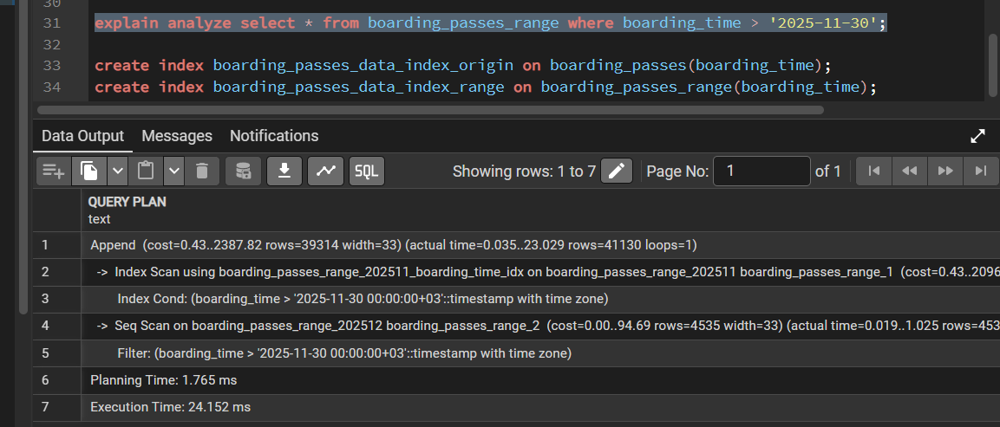

**Выполнение домашнего задания: "Секционирование"**

1. Создал тестовую бд bookings;

2. Выбрал таблицу boarding_passes для секционирования, т.к. размер таблицы достаточно большой и предполагаю доступ к данным будет быcтрее и удобнее. Секционирование будет осуществляться по столбцу времени посадки boarding_time по месяцам;

3. Выбрал минимальную и максимальную дату посадки пассажиров. Команда `SELECT Max(boarding_time) as max, Min(boarding_time) as min FROM bookings.boarding_passes;` Минумум: 2025-10-01 02:32:30, максимум: 2025-12-01 02:59:52;

4. Создал головную таблицу boarding_passes_range и секции по месячно:

5. Перенёс данные из оригинальной таблицы в таблицу с секциями по месяцам:

Проверил данные. Всё корректно. Пример для range_10:

6. Выполнил выборки по дате без добавления индексов в таблицы.
На оригинальной таблице:
Execution Time: 215.371 ms

На таблице с секционированием:
Execution Time: 110.217 ms

Поиск происходит быстрее.
7. Создал индексы на оригинальную таблицу и таблицу с секциями. Повторил выборки:
На оригинальной таблице:
Execution Time: 33.032 ms

На таблице с секционированием:
Execution Time: 24.152 ms

Поиск происходит быстрее.
8. Проверил, что вставка, удаление, обновление корректно отрабатывают на таблице с секционированием. Примеры скриптов приложил в общий файл скриптов Partioning.sql;

Вывод: Секционирование таблицы необходимо при больших данных в таблице. Обеспечивает боолее быстрый доступ к данным, также помогает с администрированием базы данных, а именно перенос данных по секциям в архив, на другое табличное пространство и т.п.
Как видно из выборок на относительно маленьком объёме данных тоже есть эффект в плане выборки данных.