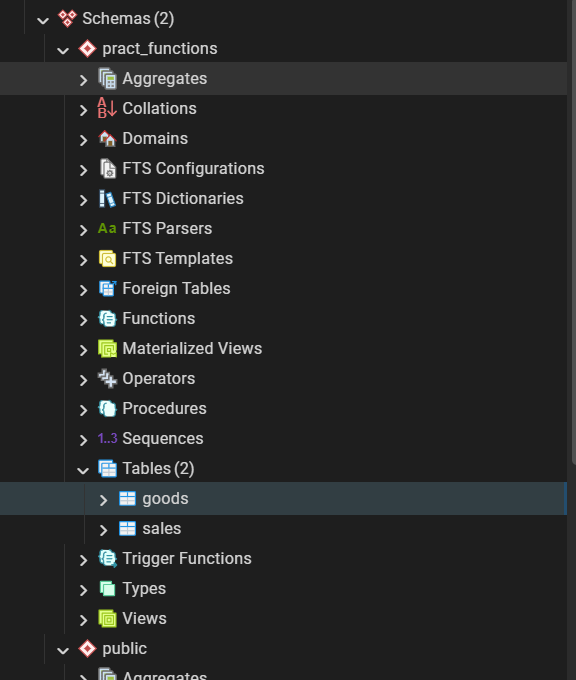
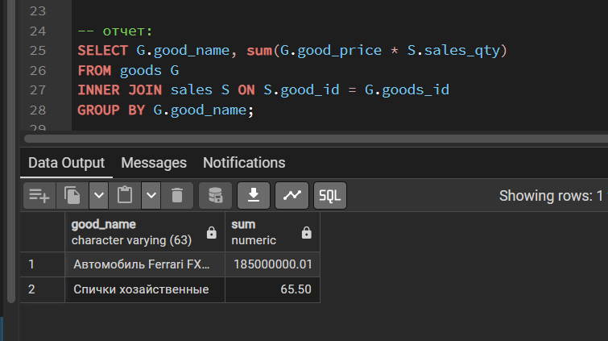
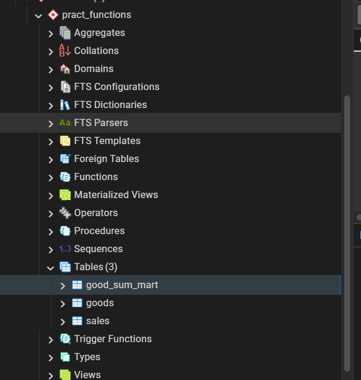
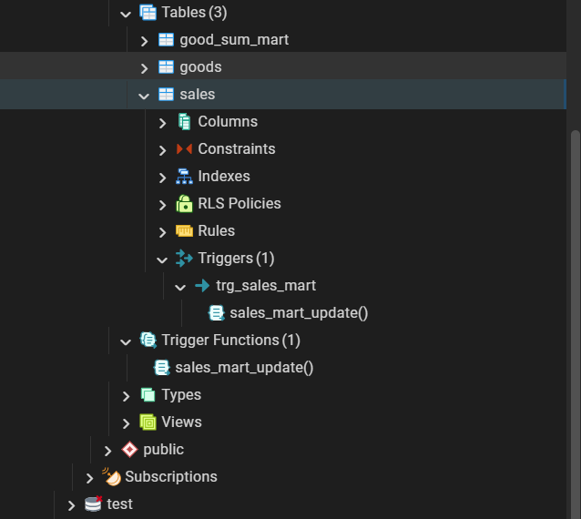
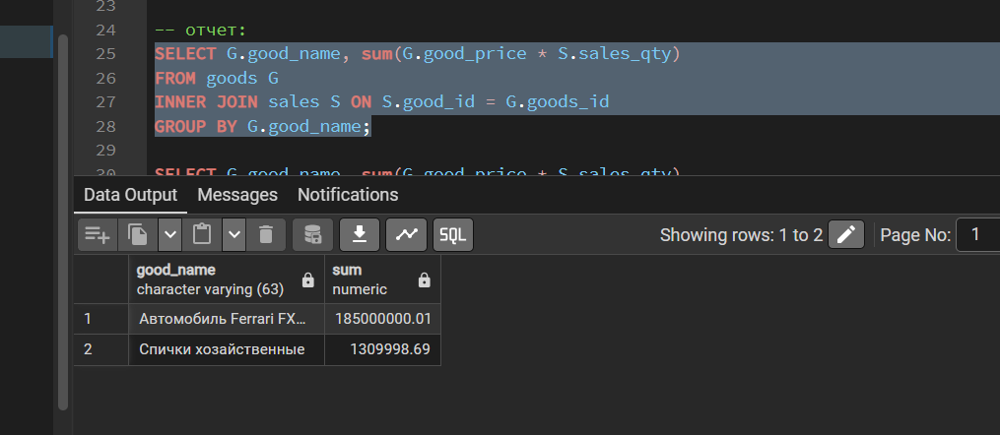
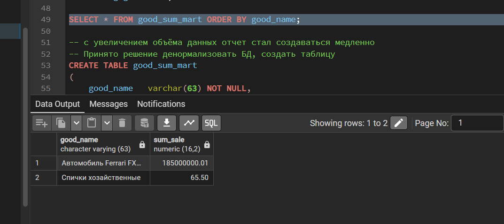

**Выполнение домашнего задания: "Секционирование"**

1. Создал схему pract_functions. Создал в схеме две таблицы goods и sales и наполнил данными;

2. Вызвал выборку, которая показыват сумма продаж по каждому товару;

3. Создал таблицу продаж для денормализации;

4. Сделал функцию и триггер для обновления витрины суммы продаж;

5. Заполнил данные в таблицу good_sum_mart. Выполнил выборку новой таблицы `SELECT * FROM good_sum_mart ORDER BY good_name;` Данные совпали с отчётом из п.2;

6. Изменим цену на товар (на спички). Выполним повторные выборки отчёта и витрины;
Результат select из п.2 изменился:

Результат выборки из п.5 не изменился:

7. Если цены в good_price меняются:
- старые продажи должны считаться по старой цене,
- отчёт при JOIN всегда возьмет новую цену, что даст неверные данные.

Витрина же хранит уже рассчитанные суммы, которые не зависят от изменения стоимости товара. Поэтому витрина обеспечит корректность исторических данных.