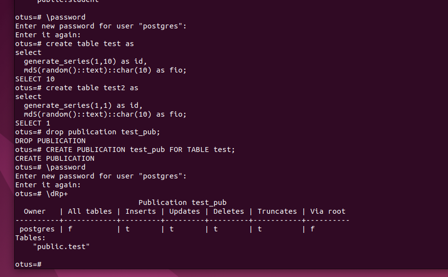
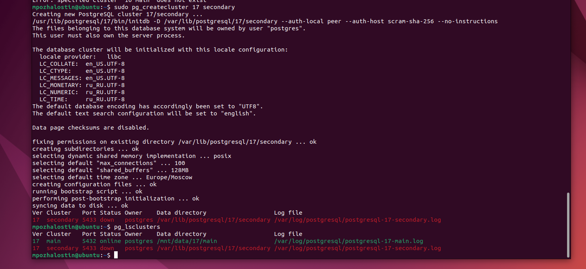
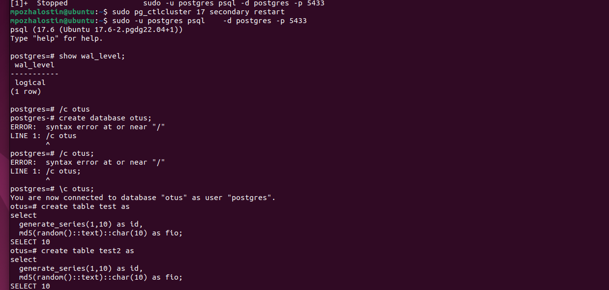
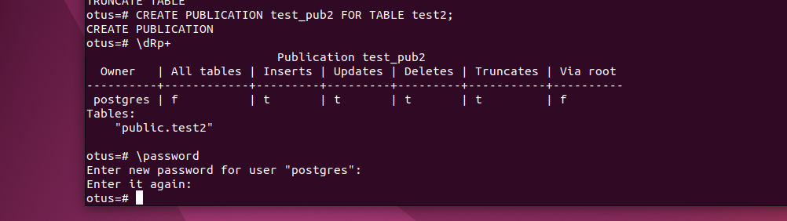
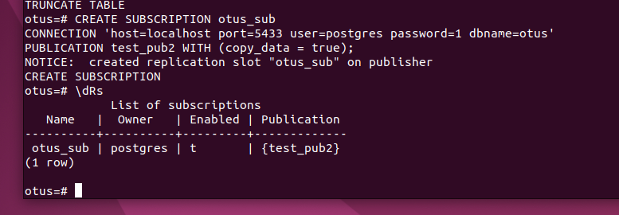
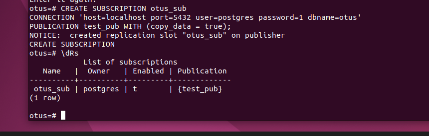
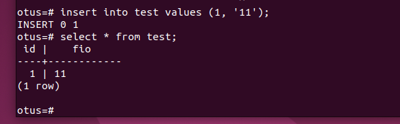
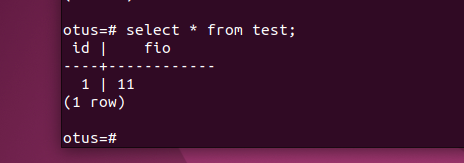
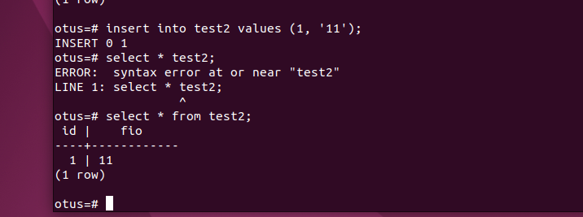
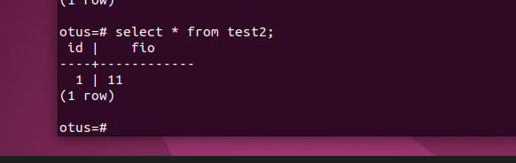

**Выполнение домашнего задания: "Репликация"**

1. Запустил первый кластер на порте 5432 Postgres 17. Выставил wal_level logical. Создал БД otus, создал таблицы test и test2. Сделал публикацию таблицы test;

2. Создал новый кластер Secondary на порте 5433 Postgres 17;

3. На Secondary выставил wal_level logical. Создал БД otus, создал таблицы test и test2. Сделал публикацию таблицы test2;

4. Сделал подписку на первом кластере таблицы test2 на таблицу test во втором кластере;

5. Сделал подписку на втором кластере таблицы test2 на таблицу test во первом кластере;

6. Проверил публикацию test из первого кластера в test второго. Всё работает, данные при вставке в первом появидись во втором;

7. Аналогично проверил публикацию test2 во втором кластере и подписку test2 в первом. Всё отработало;

8. По аналогии с пунктом 1, 2 создал третий кластер. Создал базу otus, создал таблицы test и test2. Подписал test на таблицу test из первого кластера, подписал test2 на таблицу из второго кластера;